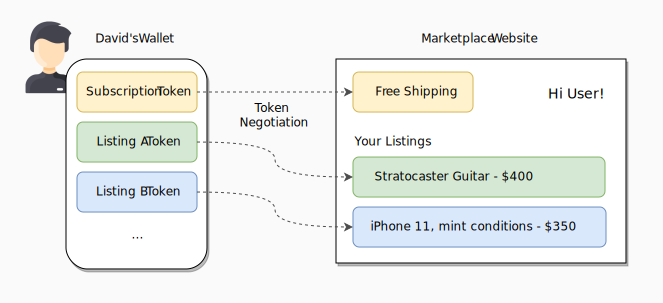
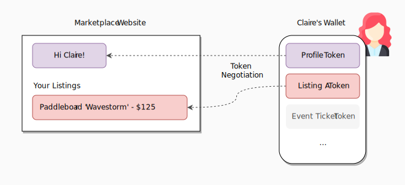
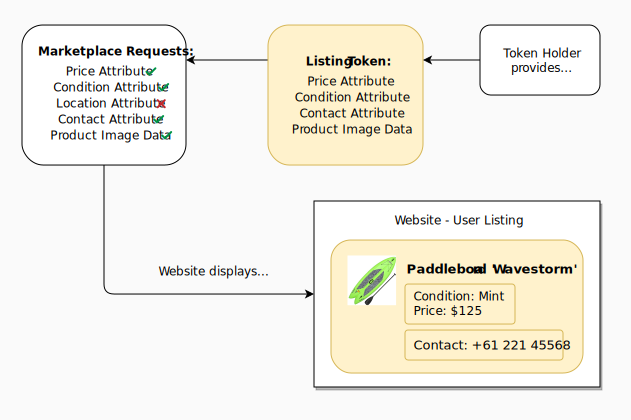

# Introduction to Token Negotiation

If you think of a marketplace service such as Gumtree or OLX on the “standard” Web, the user enters the website and finds himself in the landing page. He clicks “login” and inputs his credentials and password. The website checks this against a database and returns a profile that includes his personal data, his payment details and his sales listings. In this model, websites are directories for content as well as “banks” and gatekeepers for all user data.

On the **tokenized Web**, when the user enters the website, he immediately sees all his information and sales listings. He doesn’t need to insert his credentials. This happens through Token Negotiation, a process where a website discovers what tokens it can use from which the user has.

How? The user holds his tokenized information in his browser or mobile wallet, such as his Details Token and his Listing Tokens. When entering a tokenized website, it may ask…

- Who are you?
- What do you have?
- What do you know?

The user “answers” with his tokens and the website displays content and available action accordingly. Login becomes optional. The website might need all token information, some or none at all. The website will ignore tokens that are not useful to their system (or that they are forbidden to use). It’s up to the developer and his designed user experience.

The marketplace displays his listings and adds functionality (free shipping) for the user.

On a tokenized Web, the user holds his own tokens and websites display what he owns or provide action. The user is the "banker" of his own assets.

The marketplace may use available tokens (such as a Profile token) to enrichen the experience. It ignores unrelated tokens.

Different websites and smart contracts will ask for different data they need to work. Any system that is able to read & interpret token data may ask. For example, point-of-sale machines, highway toll booths, gate scanners, mobile apps, IoT light bulbs, and anything else.

## What tokens to use (and how)?

The issuer defines how each token is used or interpreted through the following negotiation methods:

<section data-conref="../TokenNegotiation.dita#negotiation_methods" />

When the tokens are used, the website displays content or makes actions available to the user. This can be be done automatically by the system or manually triggered by user interaction.

The website or smart contract owner may require specific information to enable his services. For example, if the user wants his listing token to appear in our Marketplace, it can determine that the token must include the “Price” and “Conditions” attribute, but that “Location” is optional.

If the user wants his Payment token to be available, the developer might determine that the token must include a “Whitelist Attestation” from a third-party provider. The website will enable payment actions accordingly.

